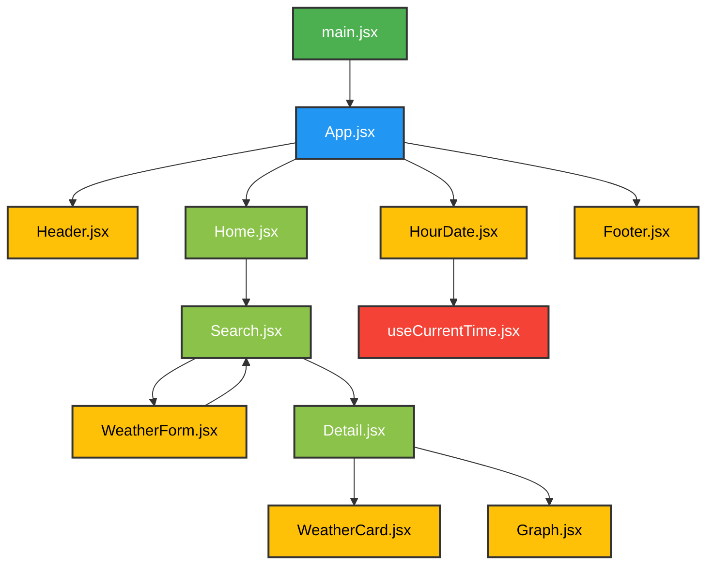
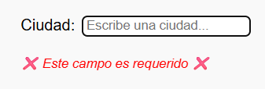
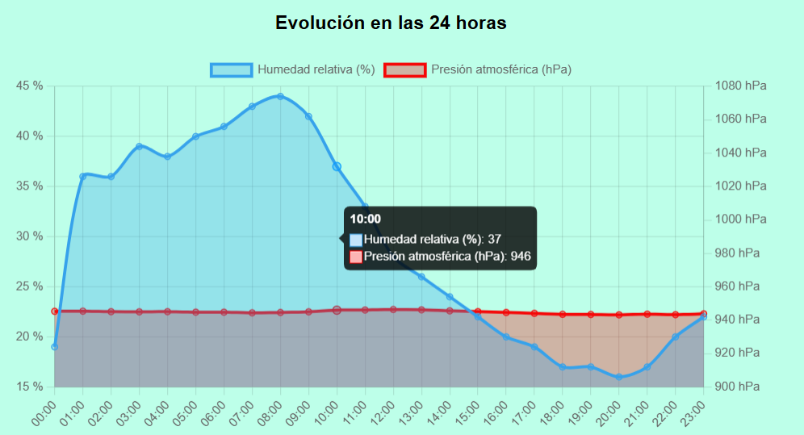

# üìñ CLIMAXPLORER

Este proyecto desarrolla una página web SPA que nos permite indicar la ciudad y la fecha de la que queremos consultar la climatología, así como, una lista de variables climáticas a elegir. Con esta información la aplicación nos devuelve es información ordenada.

## ✒️ Exigencias del proyecto:

- SPA con tres p√°ginas usando React-router-dom
- Al menos, tres estados usando useState
- Usar, al menos, un useEffect haciendo un fetch a una API
- El uso de una API, en este caso Open-Meteo y Geocoding
- Uso de un formulario controlado con react-hook-form
- Componentes reutilizables
- P√°gina web Full Responsive
- Uso de un useContext. El context se llama dataContext.
- Uso, de al menos, un custom hook. Es un hook llamado useCurrentTime que nos muestra la hora actual actualiz√°ndola cada segundo.

## ✒️ Tecnologías usadas:

- react
- react-dom
- react-router-dom
- react-hook-form
- chart.js
- react-chartjs-2
- mathjs
- react-toastify
- Open-Meteo API
- Geocoding API
- CSS

## ✒️ Estructura de archivos:
src/  
├── App.jsx  
├── main.jsx  
├── assets/  
│ ├── icons/  
│ └── images/  
├── hooks/  
│ └── useCurrentTime.jsx  
├── styles/  
│ ├── detail.css  
│ ├── footer.css  
│ ├── header.css  
│ ├── home.css  
│ ├── hourdate.css  
│ ├── search.css  
│ └── weathercard.css  
├── pages/  
│ ├── Home.jsx  
│ ├── Search.jsx  
│ └── Detail.jsx  
├── components/  
| ├── Footer.jsx  
| ├── Graph.jsx  
| ├── Header.jsx  
| ├── HourDate.jsx  
│ ├── WeatherForm.jsx  
└ └── WeatherCard.jsx  

## ✒️ Estructura del proyecto:

```mermaid
flowchart TD
    A[main.jsx] --> B[App.jsx]
    B[App.jsx] --> C[Header.jsx]
    B[App.jsx] --> D[HourDate.jsx]
    B[App.jsx] --> E[Home.jsx]
    B[App.jsx] --> F[Footer.jsx]
    E[Home.jsx] --> G[Search.jsx]
    G[Search.jsx] --> H[WeatherForm.jsx]
    G[Search.jsx] --> I[Detail.jsx]
    H[WeatherForm.jsx] --> G[Search.jsx]
    I[Detail.jsx] --> J[WeatherCard.jsx]
    I[Detail.jsx] --> K[Graph.jsx]
    D[HourDate.jsx] --> L[useCurrentTime.jsx]

    %% Colores personalizados nodo a nodo
    style A fill:#4CAF50,stroke:#333,stroke-width:2px,color:white
    style B fill:#2196F3,stroke:#333,stroke-width:2px,color:white
    style C fill:#FFC107,stroke:#333,stroke-width:2px,color:black
    style D fill:#FFC107,stroke:#333,stroke-width:2px,color:black
    style E fill:#8BC34A,stroke:#333,stroke-width:2px,color:white
    style F fill:#FFC107,stroke:#333,stroke-width:2px,color:black
    style G fill:#8BC34A,stroke:#333,stroke-width:2px,color:white
    style H fill:#FFC107,stroke:#333,stroke-width:2px,color:black
    style I fill:#8BC34A,stroke:#333,stroke-width:2px,color:white
    style J fill:#FFC107,stroke:#333,stroke-width:2px,color:black
    style K fill:#FFC107,stroke:#333,stroke-width:2px,color:black
    style L fill:#F44336,stroke:#333,stroke-width:2px,color:white

```


## ✒️ Instalación:
```bash
git clone https://github.com/luigiSotomayor/Climaxplorer.git
cd Climaxplorer
npm install
npm run dev
```

## ✒️ Modo de Uso:
<div style="display: flex; align-items: center; justify-content: center">
    
    
     
</div>
   <p> La aplicación se abre con el componente <code>Home.jsx</code>, donde se nos hace una introducción de la aplicación y tenemos un botón
    para continuar hacia el formulario.
    El formulario nos solicita en primer lugar la ciudad sobre la cual queremos conocer las variables climatológicas, y en segundo lugar la fecha. 
    Estos dos campos son obligatorios, y de no ser rellenados nos saldr√° un mensaje de aviso
    para que los completemos.</p>
    <p>A continuación tenemos un checklist con todas las variables climáticas que podemos solicitar. En el momento en que rellenemos algo del formulario, se activará el botón de <strong>Consultar</strong>. Esto nos renderizará una nueva pantalla con los datos solicitados.</p>
  <div>
  
  
  </div>
    <p>En todo momento podemos volver al inicio haciendo click sobre el título <strong>ClimaXplorer</strong> que hay centrado en el encabezado.</p>

## ✒️ Funcionalidades: 
- Consultar par√°metros clim√°ticos de la ciudad que quieras. 
- Muestra la fecha y hora actuales. 
- Muestra los datos clim√°ticos solicitados. 
- La humedad relativa y la presión muestra la media y un gráfico de cómo evolucionan durante las 24 horas de un día.

## ✒️ Contribuciones:
Para contribuir con este proyecto puedes hacer lo siguiente: 
1. Haz un fork del proyecto. 
2. Crea una rama: `git checkout -b feature/nueva-funcionalidad` (en nueva-funcionalidad pon el nombre de tu funcionalidad). 
3. Envía el pull request.

## ✒️ Autor:
Este web esta creada y diseñada por Luis Sotomayor.  
Puedes contactar conmigo a través de mi [github](https://github.com/luigiSotomayor)
